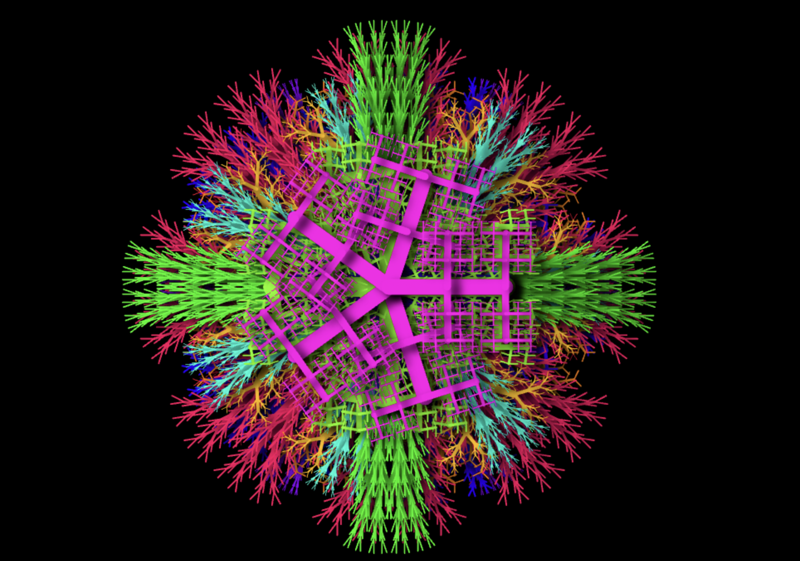
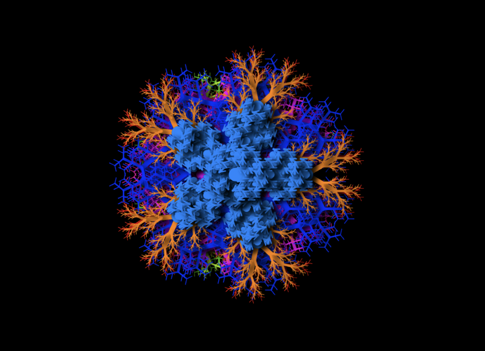
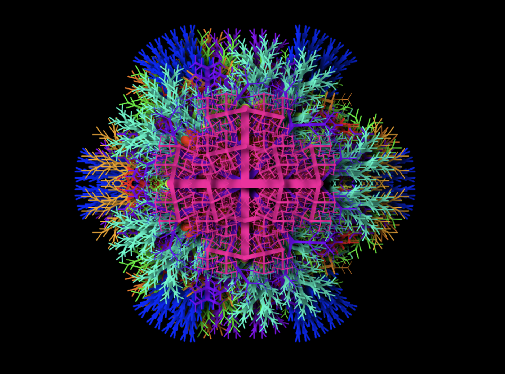
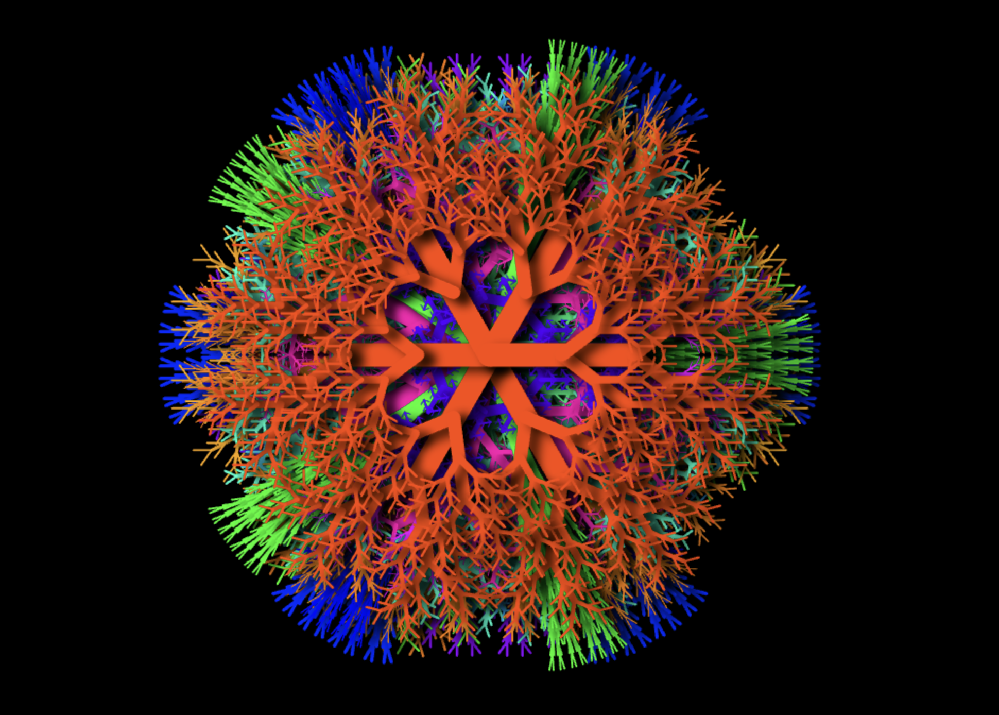

### DESCRIPTION :

- a simple project in typescript and Canvas html5 in which we can generate different shapes with random colors

### PREVIEW

  
  
  
  

### INSTRUCTIONS :

###### clone the projet

- `clone https://github.com/Mrkouhadi/ts-canvas.git`

###### compile the typescript code (src/index.ts) into Javscript (build/index.js)

- `tsc --w`
